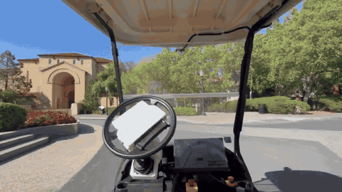
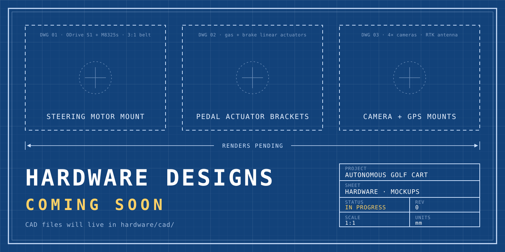

<div align="center">

# Autonomous Golf Cart

**An open-source, full-stack self-driving golf cart: perception, planning, control, firmware, and hardware.**

<p>
  <a href="LICENSE"></a>
  
  
  
</p>



<sub>The cart driving itself through Stanford campus. Nobody touches the wheel.</sub>

<p>
  <a href="#architecture">Architecture</a> ·
  <a href="#quick-start">Quick start</a> ·
  <a href="#drive-the-real-cart-from-python">Drive the cart</a> ·
  <a href="#hardware">Hardware</a> ·
  <a href="#safety">Safety</a>
</p>

</div>

---

## Overview

This project turns a standard electric golf cart into a self-driving vehicle using
off-the-shelf parts: an NVIDIA Jetson for compute, an ODrive-driven steering column,
linear actuators on the pedals, an RTK GNSS receiver, and cameras.

The cart's driving policies live in [`policies/`](policies). The two
stacks share one hardware API:

<table>
<tr>
<td width="50%" valign="top">

### 🛰️ [Drive by RTK](policies/rtk)
Follow waypoints with **centimeter-level RTK GPS**. Draw lanes on a map, pick a
route in the web UI, press **Drive**, and a pure-pursuit controller steers the
cart along it.

</td>
<td width="50%" valign="top">

### 👁️ [Drive by Segmentation](policies/segmentation)
Drive from **a camera alone**. SegFormer segments the road, the drivable area
is projected into a bird's-eye view, and a lane-aware planner outputs a
trajectory and steering angle.

</td>
</tr>
<tr>
<td colspan="2" align="center">

### ⚙️ [cart-api](cart-api) · `cartlib`
One Python interface to the RTK GPS, steering, gas, and brake. Both stacks drive through it.

</td>
</tr>
</table>

<div align="center">

<br><sub>Drive by Segmentation: SegFormer road mask (purple) on campus footage</sub>
</div>

## Architecture

```
            ┌──────────────────────────┐        ┌──────────────────────────────┐
            │       policies/rtk       │        │    policies/segmentation     │
            │ map UI · route graph ·   │        │ SegFormer · BEV projection · │
            │ pure-pursuit follower    │        │ lane-aware planner           │
            └────────────┬─────────────┘        └──────────────┬───────────────┘
                         │   steer_deg · gas · brake           │
                         └──────────────────┬──────────────────┘
                                            ▼
                    ┌─────────────────────────────────────────────┐
                    │            cart-api  (cartlib)              │
                    │  Cart · GpsReceiver · NtripClient ·         │
                    │  SteeringController · PedalController       │
                    └──────┬─────────────────┬─────────────────┬──┘
                    USB-CDC│ ODrive ASCII    │ serial G/B/S/H/D│ NMEA / RTCM
                           ▼                 ▼                 ▼
                    ┌─────────────┐   ┌──────────────┐  ┌──────────────┐
                    │  ODrive S1  │   │ Arduino Mega │  │ u-blox ZED-F9│
                    │  + M8325s   │   │ pedal fw +   │  │ RTK receiver │
                    │  steering   │   │ watchdog     │  │ + NTRIP      │
                    └─────────────┘   └──────┬───────┘  └──────────────┘
                                             ▼
                                   gas + brake actuators
                                   (hardware e-stop loop)
```

Compute runs on an **NVIDIA Jetson AGX Thor**. Development also works on a laptop.
Deeper notes live in [`docs/architecture.md`](docs/architecture.md).

## Quick start

```bash
git clone https://github.com/ethandgoodhart/autonomous-golf-cart.git
cd autonomous-golf-cart

# 1. Install the cart API
pip install -e "cart-api[server]"

# 2. Check the hardware (read-only, nothing moves)
./cart-api/cart test
```

```
[GPS]      fix=GPS sats=12 hdop=0.54  lat=37.426562 lon=-122.164102      PASS
[PEDALS]   gas_pot=0.007 brake_pot=0.009  failsafe=True estop=False      PASS
[STEERING] bus_voltage=47.5 V  angle=-0.01°  state=IDLE  errors=0        PASS
```

**Drive by RTK**

```bash
export MAPBOX_TOKEN=pk.your_token
export NTRIP_RTKDATA_USER=...  NTRIP_RTKDATA_PASS=...
./policies/rtk/golive.sh --ntrip          # → http://localhost:3001
```

**Drive by segmentation**

```bash
pip install -r policies/segmentation/requirements.txt
python policies/segmentation/live.py --source 0 --model b2
```

## Drive the real cart from Python

The cart API is how every policy moves the actual cart. These calls turn the
steering column and press the pedals on the real vehicle.

```python
from cartlib import Cart

with Cart() as cart:
    cart.arm()                       # GPS streaming, pedals out of failsafe
    print(cart.snapshot())           # live GPS + pedals + steering state

    cart.steering.enable()           # energize steering motor
    cart.steering.set_angle(15)      # +15° at the steering column
    cart.pedals.set_brake(0.2)       # brake (always safe)
    cart.stop()                      # release pedals
```

| Command | What it does |
|---------|--------------|
| `cart test` | Read-only self-test of all three subsystems |
| `cart read [--ntrip]` | Live read-only dashboard |
| `cart record PATH` | Drive manually and record an RTK path |
| `cart follow PATH` | Preview a path (dry run) |
| `cart drive PATH --max-speed X` | Drive the path autonomously |
| `cart serve [--gps-only]` | WebSocket bridge for the map UI (`ws://localhost:8765`) |

Full reference: [`cart-api/README.md`](cart-api/README.md).

## Hardware

<div align="center">

</div>

| Subsystem | Hardware | Interface |
|-----------|----------|-----------|
| Compute | NVIDIA Jetson AGX Thor | — |
| Steering | ODrive S1 + M8325s, 3:1 HTD 5M belt | USB · ODrive ASCII |
| Gas + brake | 2× linear actuators, BTS7960 drivers, Arduino Mega 2560 | USB serial |
| Localization | u-blox ZED-F9x RTK GNSS + NTRIP corrections | NMEA / RTCM |
| Vision | 4× USB cameras incl. 170° fisheye front camera | UVC |
| Safety | Hardware e-stop + firmware heartbeat watchdog | — |

CAD, wiring diagrams, and board files go in [`hardware/`](hardware). Subsystem
write-ups are in [`docs/`](docs): [steering](docs/steering.md) ·
[pedal actuators](docs/linear_actuators.md) · [e-stop](docs/estop.md) ·
[GPS](docs/gps.md) · [cameras](docs/cameras.md).

## Safety

> [!WARNING]
> This software moves a real vehicle. Always test in a closed area, at low speed,
> with a person ready on the hardware e-stop.

- The pedal firmware boots in **FAILSAFE** and re-enters it (gas released, **brake applied**) if the host heartbeat stops for more than 300 ms.
- A hardware **e-stop** forces full brake and zero gas at the firmware level.
- Throttle is capped in layers: hardware pot max → global speed limit → per-mode cap. See [`hardware/arduino-sketches/limits.py`](hardware/arduino-sketches/limits.py).
- Anything that moves the cart is opt-in. The gas demo additionally requires `--i-understand-this-drives`.

## Contributing

Issues and pull requests are welcome.

## License

Released under the [MIT License](LICENSE).
