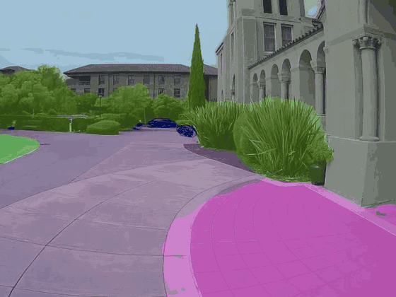

# drive-by-segmentation

Camera-only driving. A single wide-angle front camera is segmented with
**SegFormer** (Cityscapes), projected to a **bird's-eye view** with the
calibrated fisheye model, and a **lane-aware centerline planner** turns the
drivable area into a trajectory and a steering command.

<p align="center">
  
</p>

## Pipeline

```
camera frame ─▶ SegFormer (b0/b2/b5) ─▶ class map ─▶ BEV projection ─▶ drivable mask
                                                                         │
            GPS route (optional) ─▶ map_route_to_bev ─────────────────────┤
                                                                         ▼
                              steering ◀─ pure pursuit ◀─ lane-aware centerline path
```

## Layout

| Path | What it does |
|------|--------------|
| `live.py` | Live steering prediction from a video file or camera (`--source 0`, `--model b2`). |
| `path_planning.py` | Frenet optimal-trajectory + MPC (bicycle model) planners on the BEV mask. |
| `render.py`, `render_trajectories.py` | Local (CPU) overlay / BEV / trajectory rendering. |
| `render_depth.py`, `render_depth_seg.py` | Depth + segmentation fused visualizations. |
| `voxel_viewer.py` | Interactive 3D point-cloud viewer, colored by semantic class. |
| `bev_tuner.html` | In-browser tuner for BEV projection parameters. |
| `camera_calibration.json` | Fisheye intrinsics + mounting extrinsics (ELP 170° camera, 1.78 m high). |
| `*_modal.py`, `eval_segmentation.py` | GPU batch jobs on [Modal](https://modal.com) (segmentation, depth, rendering, export). |
| `onboard/` | On-cart runtime for the Jetson: fast BEV projection, live planner sidecar, SegFormer → TensorRT export. |
| `test_bev.py`, `test_lane_planner.py` | Quick sanity checks. |

## Quick start

```bash
pip install -r requirements.txt

# live steering on a video or webcam
python live.py --source path/to/drive.mp4
python live.py --source 0 --model b2

# batch segmentation on a cloud GPU
modal run seg_modal.py
```

### On the cart (Jetson AGX Thor)

```bash
# build a TensorRT engine for SegFormer
python onboard/export_segformer_trt.py

# live planner sidecar: reads /tmp/cart_frames/*, writes steer + pedal targets
python onboard/segmentation_infer.py
```

The sidecar publishes `steer_deg` and `target_gas` / `target_brake` to a JSON
state file that the drive loop consumes; actuation goes through
[`cart-api`](../cart-api).
